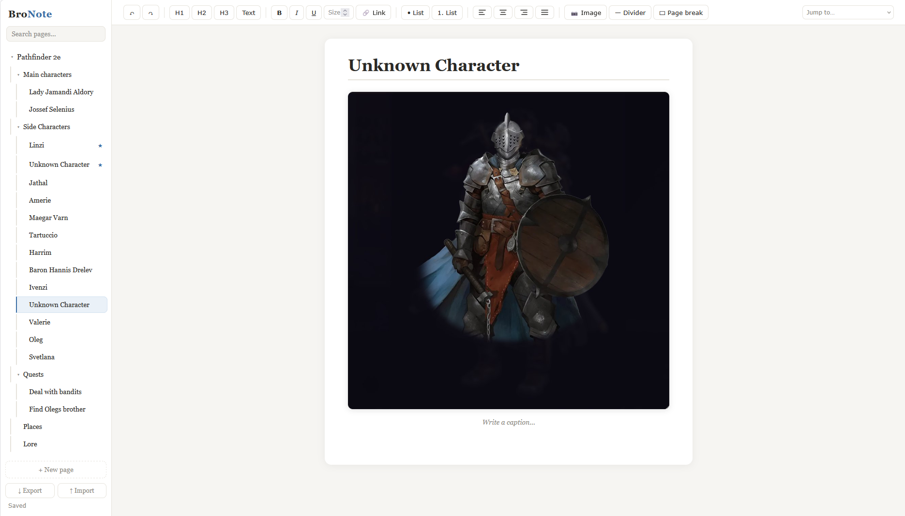
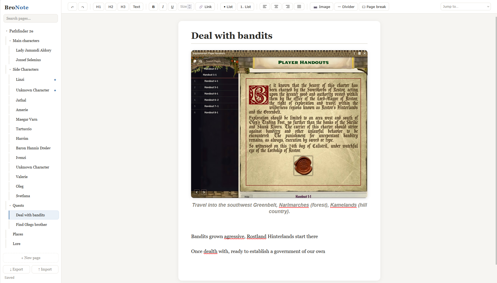
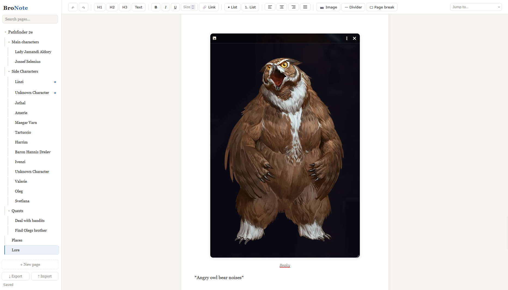

# BroNote

A note-taking app in a single HTML file. No install, no account, no cloud, no subscription. You double-click the file and write.

Made it because Word felt like overkill for keeping Pathfinder campaign notes. It doesn't care what you use it for.

> How much is the subscription? "Nothing, that's the best part."

## Getting started

1. Download `BroNote.html`
2. Open it in a browser (double-click)
3. Write. Everything saves automatically.

## Features

- Formatting: headings, bold/italic/underline, lists, alignment, links, text size in points like Word
- Pages and subpages, nested as deep as you want. Drag to reorder or nest, pin favourites, collapse branches
- Images with captions. Paste them, drag them in, or use the Image button. Resize from the corner grip. Big photos get compressed automatically
- Search across all pages
- Undo that survives closing the app, 100 steps per page. Deleting a page is also undoable
- Page breaks and dividers for splitting up long pages
- Works on phones, the sidebar turns into a drawer

## Sharing notes

The app and the notes are separate files.

- Send someone `BroNote.html` and they get the app, empty
- Export (bottom of the sidebar) saves all your notes as a json backup. You actually get two files: one full quality, one with compressed images that is easier to send over Discord
- Import loads a backup. Pages you already have get updated in place, new pages get added, and pages you made yourself are left alone. So a group can share one file, update it weekly, and everyone just re-imports it without ending up with duplicates
- The down arrow on a page card exports only that page and its subpages, good for sharing a single character or quest

## Shortcuts

| Keys | Action |
|---|---|
| Ctrl+B / I / U | Bold / italic / underline |
| Ctrl+K | Insert or edit a link (Ctrl+Click opens it) |
| Ctrl+Z / Ctrl+Y | Undo / redo, works even after a restart |
| Ctrl+L / E / R / J | Align left / center / right / justify |
| `1. text` + Enter | Starts a numbered list (`- text` for bullets) |
| Backspace next to an image | Deletes the image |

## Good to know

- One file, no dependencies, plain JavaScript. View Source is the documentation
- Notes are stored in your browser (IndexedDB), they never leave your machine. Export once in a while if they matter to you
- Tested mostly in Firefox, plus Chrome and Edge. Anything modern should be fine
- Firefox quirk: notes are tied to where the file sits on disk, so keep `BroNote.html` in one place. If you move it and your notes seem gone, move it back

## Contributing

It's one file. Open it, change it, send a pull request. Bug reports with steps to reproduce are appreciated.

## License

MIT, see [LICENSE](LICENSE). Use it, fork it, give it to your gaming group.
